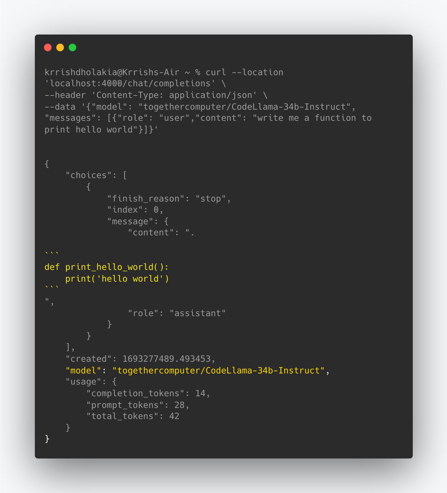

# CodeLlama Server: Streaming, Caching, Model Fallbacks (OpenAI + Anthropic), Prompt-tracking

Works with: Anthropic, Huggingface, Cohere, TogetherAI, Azure, OpenAI, etc.

[](https://pypi.org/project/litellm/)
[](https://pypi.org/project/litellm/0.1.1/)


[](https://railway.app/template/HuDPw-?referralCode=jch2ME)

## What does liteLLM Code-Gen do

- Make `/chat/completions` streaming requests for 100+ LLM models 
- Sets default system prompt for guardrails `system_prompt = "Only respond to questions about code. Say 'I don't know' to anything outside of that."`
- Integrates with Promptlayer for model + prompt tracking 
- Example output



- **Consistent Input/Output** Format
  - Call all models using the OpenAI format - `completion(model, messages)`
  - Text responses will always be available at `['choices'][0]['message']['content']`
  - Stream responses will always be available at `['choices'][0]['delta']['content']`
- **Error Handling** Using Model Fallbacks (if `CodeLlama` fails, try `GPT-4`) with cooldowns, and retries
- **Logging** - Log Requests, Responses and Errors to `Supabase`, `Posthog`, `Mixpanel`, `Sentry`, `LLMonitor,` `Helicone` (Any of the supported providers here: https://litellm.readthedocs.io/en/latest/advanced/

  **Example: Logs sent to Supabase**
  

- **Token Usage & Spend** - Track Input + Completion tokens used + Spend/model - https://docs.litellm.ai/docs/token_usage
- **Caching** - Provides in-memory cache + GPT-Cache integration for more advanced usage - https://docs.litellm.ai/docs/caching/gpt_cache

- **Streaming & Async Support** - Return generators to stream text responses

## API Endpoints

### `/chat/completions` (POST)

This endpoint is used to generate chat completions for 50+ support LLM API Models. Use llama2, GPT-4, Claude2 etc

#### Input

This API endpoint accepts all inputs in raw JSON and expects the following inputs

- `model` (string, required): ID of the model to use for chat completions. See all supported models [here]: (https://litellm.readthedocs.io/en/latest/supported/):
  eg `gpt-3.5-turbo`, `gpt-4`, `claude-2`, `command-nightly`, `stabilityai/stablecode-completion-alpha-3b-4k`
- `messages` (array, required): A list of messages representing the conversation context. Each message should have a `role` (system, user, assistant, or function), `content` (message text), and `name` (for function role).
- Additional Optional parameters: `temperature`, `functions`, `function_call`, `top_p`, `n`, `stream`. See the full list of supported inputs here: https://litellm.readthedocs.io/en/latest/input/

#### Example JSON body

For claude-2

```json
{
  "model": "claude-2",
  "messages": [
    {
      "content": "Hello, whats the weather in San Francisco??",
      "role": "user"
    }
  ]
}
```

### Making an API request to the Code-Gen Server

```python
import requests
import json

# TODO: use your URL
url = "http://localhost:5000/chat/completions"

payload = json.dumps({
  "model": "gpt-3.5-turbo",
  "messages": [
    {
      "content": "Hello, whats the weather in San Francisco??",
      "role": "user"
    }
  ]
})
headers = {
  'Content-Type': 'application/json'
}
response = requests.request("POST", url, headers=headers, data=payload)
print(response.text)

```

### Output [Response Format]

Responses from the server are given in the following format.
All responses from the server are returned in the following format (for all LLM models). More info on output here: https://litellm.readthedocs.io/en/latest/output/

```json
{
  "choices": [
    {
      "finish_reason": "stop",
      "index": 0,
      "message": {
        "content": "I'm sorry, but I don't have the capability to provide real-time weather information. However, you can easily check the weather in San Francisco by searching online or using a weather app on your phone.",
        "role": "assistant"
      }
    }
  ],
  "created": 1691790381,
  "id": "chatcmpl-7mUFZlOEgdohHRDx2UpYPRTejirzb",
  "model": "gpt-3.5-turbo-0613",
  "object": "chat.completion",
  "usage": {
    "completion_tokens": 41,
    "prompt_tokens": 16,
    "total_tokens": 57
  }
}
```

## Installation & Usage

### Running Locally

1. Clone liteLLM repository to your local machine:
   ```
   git clone https://github.com/BerriAI/litellm-CodeGen-proxy
   ```
2. Install the required dependencies using pip
   ```
   pip install requirements.txt
   ```
3. Set your LLM API keys
   ```
   os.environ['OPENAI_API_KEY]` = "YOUR_API_KEY"
   or
   set OPENAI_API_KEY in your .env file
   ```
4. Run the server:
   ```
   python main.py
   ```

## Deploying

1. Quick Start: Deploy on Railway

   [](https://railway.app/template/HuDPw-?referralCode=jch2ME)

2. `GCP`, `AWS`, `Azure`
   This project includes a `Dockerfile` allowing you to build and deploy a Docker Project on your providers

# Support / Talk with founders

- [Our calendar 👋](https://calendly.com/d/4mp-gd3-k5k/berriai-1-1-onboarding-litellm-hosted-version)
- [Community Discord 💭](https://discord.gg/wuPM9dRgDw)
- Our numbers 📞 +1 (770) 8783-106 / +1 (412) 618-6238
- Our emails ✉️ ishaan@berri.ai / krrish@berri.ai

## Roadmap

- [ ] Implement user-based rate-limiting
- [ ] Spending controls per project - expose key creation endpoint
- [ ] Need to store a keys db -> mapping created keys to their alias (i.e. project name)
- [ ] Easily add new models as backups / as the entry-point (add this to the available model list)
